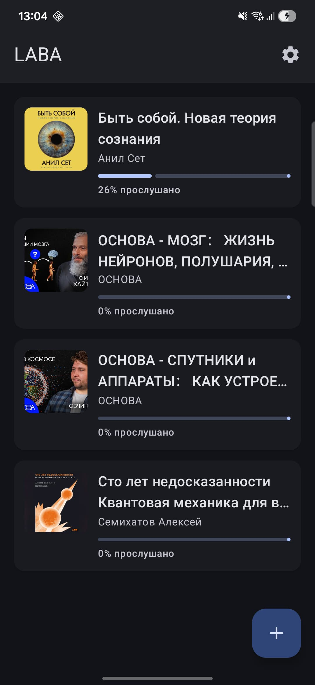
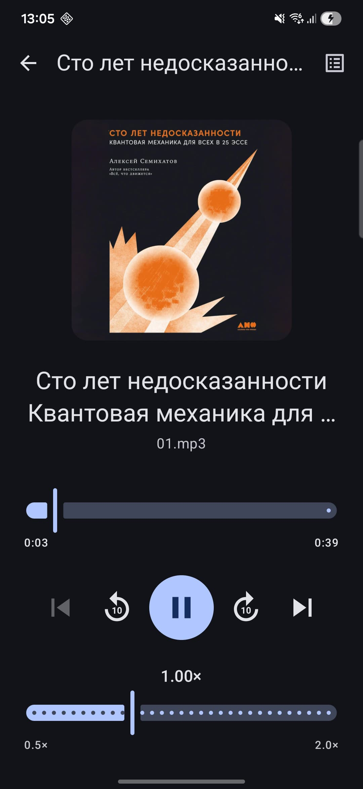
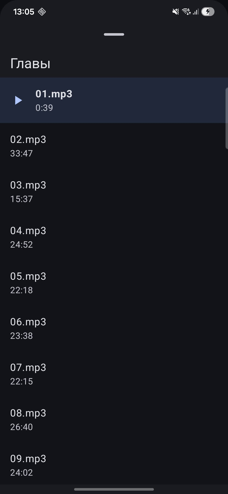
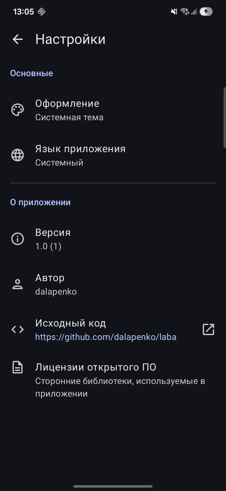

<div align="center">

# 📚 Laba

**Offline Audiobook Player for Android**

A clean, distraction-free audiobook player that works entirely offline.
No accounts. No cloud. Just your books.

<br/>

[](https://android.com)
[](https://developer.android.com/about/versions/oreo)
[](https://kotlinlang.org)
[](https://developer.android.com/jetpack/compose)
[](LICENSE)

</div>

---

## Screenshots

| Library                                    | Player                                   | Chapter Select                               | Settings                                     |
|--------------------------------------------|------------------------------------------|----------------------------------------------|----------------------------------------------|
|  |  |  |  |

---

## Features

### Library
- **Add books from a folder** — recursively scans for audio files with natural chapter ordering
- **Add individual files** — pick a single audio file directly
- **Cover art** — extracted automatically from embedded tags or folder images; falls back to stylized initials
- **Reading progress** — per-book progress bar showing how far you've listened
- **Unavailable books** — files that have been moved or deleted are shown dimmed, not deleted
- **Long-press to remove** — optionally delete the source files alongside the library entry
- **Pull-to-refresh** — re-scans availability and refreshes metadata

### Player
- **Background playback** — keeps playing when you lock your screen or switch apps
- **Playback controls** — play/pause, previous/next track, rewind/forward 10 seconds
- **Seek bar** — drag to any position within the current track
- **Playback speed** — adjustable from 0.5× to 2.0× in 0.05× steps
- **Chapter list** — bottom sheet showing all tracks; tap to jump instantly
- **Portrait & landscape** — fully responsive layout for both orientations
- **Progress saving** — your position is saved automatically and restored on next open

### Settings
- **Theme** — System, Light, or Dark mode
- **Language** — System default, English, or Russian
- **About & Licenses** — version info, author, GitHub link, and full third-party license list

---

## Tech Stack

| Layer | Technology |
|-------|-----------|
| UI | Jetpack Compose + Material 3 |
| Architecture | MVVM · StateFlow · Repository |
| DI | Koin 4.x |
| Media | Media3 ExoPlayer + MediaSessionService |
| Database | Room (KSP) |
| Storage | DataStore Preferences |
| Background | WorkManager |
| Images | Coil |
| Navigation | Navigation Compose (type-safe) |

---

## Requirements

- Android **8.1 (API 27)** or higher
- Audio files stored locally on the device or on accessible external storage

### Supported Formats

Any audio format supported by ExoPlayer — including MP3, M4A, M4B, AAC, OGG, FLAC, WAV, and OPUS.

---

## Getting Started

### Build from Source

1. Clone the repository:
   ```bash
   git clone https://github.com/dalapenko/laba.git
   cd laba
   ```

2. Open in Android Studio (Hedgehog or newer).

3. Build and run on a device or emulator (API 27+):
   ```bash
   ./gradlew assembleDebug
   ```

### Add Your First Book

1. Open the app — your library starts empty.
2. Tap **+** in the top-right corner.
3. Choose **Add Folder** to import an entire audiobook directory, or **Add File** for a single file.
4. Grant storage access when prompted.
5. Tap the book cover to start listening.

---

## Project Structure

```
app/src/main/kotlin/com/dalapenko/laba/
├── core/
│   ├── database/        # Room entities, DAOs, AppDatabase
│   ├── data/            # BookRepository, ProgressRepository
│   ├── di/              # Koin modules (App, Feature, Media)
│   ├── media/           # PlaybackService, PlaybackController, PlaybackPreparer
│   └── work/            # ProgressSaveWorker (WorkManager)
├── feature/
│   ├── library/         # LibraryScreen, LibraryViewModel, FolderScanner
│   ├── player/          # PlayerScreen, PlayerViewModel, ChapterBottomSheet
│   └── settings/        # SettingsScreen, SettingsViewModel, SettingsRepository
└── ui/
    └── theme/           # LabaTheme, Typography
```

---

## Architecture

Laba follows a single-module, package-by-feature structure with a strict MVVM layering:

```
UI (Compose) ──► ViewModel (StateFlow) ──► Repository ──► Room / DataStore
                        │
                        └──► PlaybackController ──► Media3 ExoPlayer
```

- **State** flows down as `UiState` sealed classes / data classes
- **Events** (one-shot side effects) flow via `Channel` / `SharedFlow`
- **Progress** is persisted both on track completion and periodically via WorkManager to survive process death

---

## License

```
MIT License

Copyright (c) 2025 dalapenko

Permission is hereby granted, free of charge, to any person obtaining a copy
of this software and associated documentation files (the "Software"), to deal
in the Software without restriction, including without limitation the rights
to use, copy, modify, merge, publish, distribute, sublicense, and/or sell
copies of the Software, and to permit persons to whom the Software is
furnished to do so, subject to the following conditions:

The above copyright notice and this permission notice shall be included in all
copies or substantial portions of the Software.

THE SOFTWARE IS PROVIDED "AS IS", WITHOUT WARRANTY OF ANY KIND, EXPRESS OR
IMPLIED, INCLUDING BUT NOT LIMITED TO THE WARRANTIES OF MERCHANTABILITY,
FITNESS FOR A PARTICULAR PURPOSE AND NONINFRINGEMENT. IN NO EVENT SHALL THE
AUTHORS OR COPYRIGHT HOLDERS BE LIABLE FOR ANY CLAIM, DAMAGES OR OTHER
LIABILITY, WHETHER IN AN ACTION OF CONTRACT, TORT OR OTHERWISE, ARISING FROM,
OUT OF OR IN CONNECTION WITH THE SOFTWARE OR THE USE OR OTHER DEALINGS IN
THE SOFTWARE.
```
